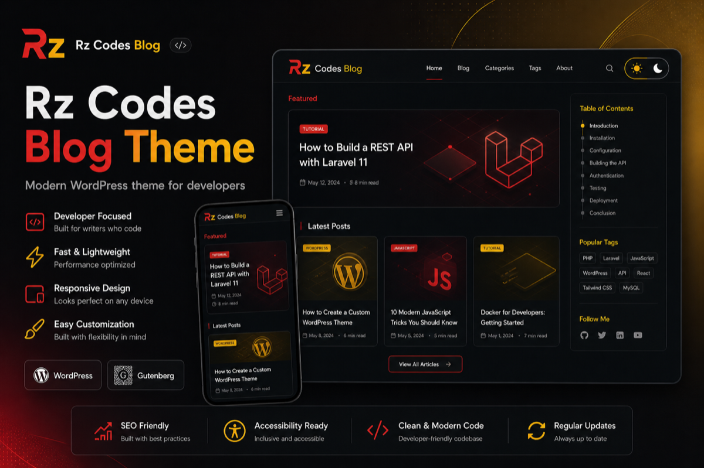
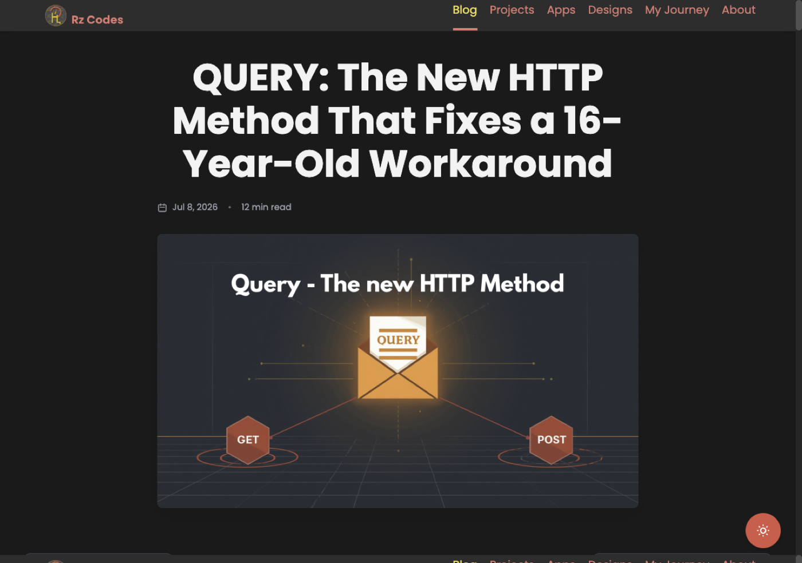
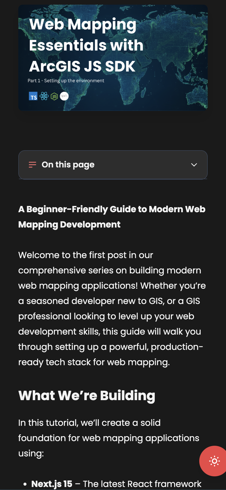
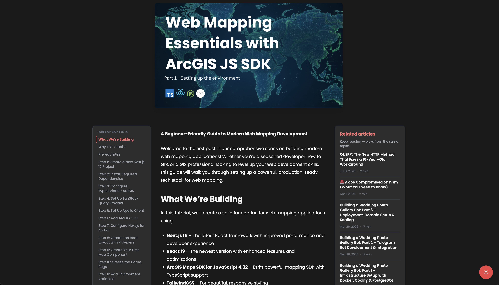

# Rz Codes Blog Theme

<p align="center">
  
</p>

<p align="center">
  <strong>A clean, fast WordPress blog theme built for developers who care about reading experience.</strong><br>
  Featured posts, smart search, table of contents, related articles, comments, and light/dark mode — out of the box.
</p>

<p align="center">
  <a href="https://blog.rz-codes.com/"></a>
  <a href="https://www.rz-codes.com"></a>
  
  
  
</p>

---

## Why this theme?

Most WordPress blog themes feel bloated or dated. **Rz Codes Blog** is the opposite: a focused reading experience with a modern layout, zero page-builder dependency, and production-ready features you would expect from a custom Gatsby site.

- **Install in minutes** — upload, activate, publish
- **Looks great on mobile** — responsive single-post layout with readable code blocks
- **Built for long-form posts** — auto table of contents, related posts, author box
- **Light & dark mode** — one-click toggle, saved in the browser

[**View live demo →**](https://blog.rz-codes.com/)

---

## Screenshots

### Blog archive
Featured hero post, live search, category filter, and a responsive article grid.

<p align="center">
  
</p>

### Single post
Three-column reading layout: table of contents, article content, and related sidebar.

<p align="center">
  
</p>

### Mobile reading
Comfortable typography and wrapped code blocks on small screens.

<p align="center">
  
</p>

### Dark mode
Easy on the eyes for late-night reading sessions.

<p align="center">
  
</p>

---

## Features

| Feature | Description |
| --- | --- |
| **Featured post hero** | Highlights your latest or most important article |
| **Search & filter** | Client-side search plus category dropdown |
| **Auto table of contents** | Generated from `h2`–`h4` headings in posts |
| **Related articles** | Sidebar picks based on shared categories |
| **Recent comments** | Keeps the sidebar active and social |
| **Author box** | Avatar, bio, and link to author archive |
| **Comments** | Native WordPress comments, styled to match |
| **Light / dark mode** | Floating toggle with localStorage persistence |
| **Contact footer** | Email, social links, and contact form section |
| **Block editor ready** | Works with Gutenberg blocks and classic content |
| **SEO-friendly markup** | Semantic HTML with Schema.org article metadata |

---

## Quick start

### 1. Download

Clone the repo or download a release:

```bash
git clone https://github.com/rabira-hierpa/rz-codes-wordpress-theme.git
```

### 2. Install

1. Zip the theme folder (or use a prepared release zip)
2. In WordPress admin go to **Appearance → Themes → Add New → Upload Theme**
3. Upload the zip and click **Activate**

> **Folder name:** WordPress expects the theme directory inside the zip. If you cloned the repo, zip the theme files so `style.css` sits at the root of the archive.

### 3. Configure

1. Go to **Settings → Reading** and set your blog page if needed
2. Open **Appearance → Customize → Site Identity**
3. Set **Portfolio site URL** (default: `https://www.rz-codes.com`) for header/footer links
4. Optionally upload your logo under **Site Identity → Logo**
5. Publish a few posts with featured images — the theme handles the rest

That is it. No plugins required.

---

## Customization

| Setting | Where | What it does |
| --- | --- | --- |
| Portfolio site URL | Customize → Site Identity | Links for Projects, Apps, About, etc. |
| Custom logo | Customize → Site Identity | Replaces the default Rz Codes logo |
| Site title & tagline | Customize → Site Identity | Standard WordPress branding |

The theme uses CSS custom properties for colors. To tweak the palette, edit `assets/css/main.css` under the `:root` and `html.dark` blocks.

---

## Requirements

- WordPress **6.0+** (recommended)
- PHP **7.4+**
- No required plugins

---

## Theme structure

```
rz-codes-wordpress-theme/
├── assets/
│   ├── css/main.css      # All theme styles
│   ├── js/theme.js       # Dark mode, mobile menu, blog search
│   └── js/single-post.js # TOC toggle & scroll spy
├── template-parts/       # Reusable partials (cards, TOC, archive)
├── single.php            # Single post layout
├── front-page.php        # Blog homepage
├── functions.php         # Theme setup & helpers
├── screenshot.png        # WordPress theme preview
└── style.css             # Theme metadata
```

---

## Perfect for

- Developer blogs and technical writing
- Portfolio sites with a separate blog section
- Personal brands that want a polished, modern look
- Teams migrating from a static site (Gatsby, Next.js) to WordPress

---

## Author

**Rabra Hierpa (Rz Codes)** — Software Engineer, GIS Developer, FOSS enthusiast

- Website: [rz-codes.com](https://www.rz-codes.com)
- Blog: [blog.rz-codes.com](https://blog.rz-codes.com)
- GitHub: [@rabira-hierpa](https://github.com/rabira-hierpa)
- LinkedIn: [@rabira](https://www.linkedin.com/in/rabira)

---

## License

This theme is licensed under the [GNU General Public License v2 or later](http://www.gnu.org/licenses/gpl-2.0.html).

Free to use, modify, and distribute. If you use it in a project, a link back is always appreciated.

---

<p align="center">
  <sub>Built with care for readers who actually finish the article.</sub>
</p>
